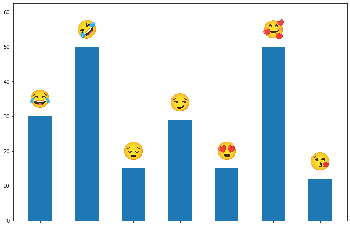

# IMOJI

a python library that maps almost every emoji to its color image
it's used to get visual representation of emoji unicode

imoji can be used to solve the problem of plotting emojis as labels in python plotting libraries

## Installation

    `pip install imoji`

## Quickstart

### Get emoji Image

```python
from PIL import Image
from imoji import imoji
Image.open(imoji.get_img_path('😂'))
```


multiple emoji is also supported 

```python
from PIL import Image
from imoji import imoji
Image.open(imoji.get_img_path('😂😂😂😂'))
```


### Plotting emojis in matplotlib

```python
from imoji import imoji
from matplotlib import pyplot as plt 
from matplotlib.offsetbox import OffsetImage,AnnotationBbox
def offset_image(cords, emoji, ax):
    img = plt.imread(imoji.get_img_path(emoji))
    im = OffsetImage(img, zoom=0.08)
    im.image.axes = ax
    ab = AnnotationBbox(im, (cords[0], cords[1]),  frameon=False, pad=0)
    ax.add_artist(ab)


emjis = ['😂', '🤣', '😔', '😏','😍', '🥰', '😘']
values =[30, 50, 15, 29, 15, 50, 12]

fig, ax = plt.subplots(figsize=(12,8))
ax.bar(range(len(emjis)), values, width=0.5,align="center")
ax.set_xticks(range(len(emjis)))
ax.set_xticklabels([])
ax.tick_params(axis='x', which='major', pad=26)
ax.set_ylim((0, ax.get_ylim()[1]+10))

for i, e in enumerate(emjis):
    offset_image([i,values[i]+5], e, ax)
```

